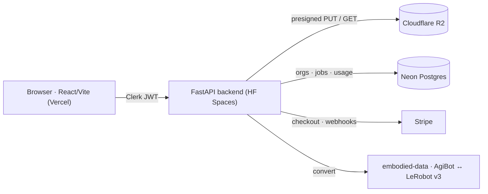

# agibridge

Hosted, multi-tenant dataset-conversion service for embodied-AI and robotics teams. Convert datasets between **AgiBot World** and **LeRobot v3** in the browser — no local setup — on top of the open-source [`embodied-data`](https://pypi.org/project/embodied-data/) library.

Library: [`embodied-data` (PyPI)](https://pypi.org/project/embodied-data/) · [source](https://github.com/allenwu-blip/embodied-data) · License: MIT

## What it does

- Upload a dataset, convert **AgiBot World ↔ LeRobot v3**, and download a valid LeRobot v3 result — entirely in the browser.
- Preprocessing, format conversion, and training-prep for robotics manipulation datasets.
- Multi-tenant: organizations, authentication, per-org data isolation, and usage tiers.

## Why it exists

Migrating datasets between LeRobot v2 and v3 is a recurring pain point across embodied-AI labs, and existing tooling is either mispriced (per-TB storage) or enterprise-only. agibridge targets that gap with a simple hosted converter built on a library that already handles the conversion.

## Architecture



Conversion flow: `upload → presigned R2 PUT → async convert job → poll job state → download LeRobot v3`.

## Engineering highlights

- **Multi-tenant data isolation.** Every storage and job access is keyed by a type-enforced `(job_id, org_id)` API; a live negative test verifies that org B cannot read org A's jobs (returns 404, never another org's data).
- **Idempotent Stripe webhooks.** Signature verification plus replay/duplicate protection, so retried or out-of-order events never corrupt subscription state.
- **Presigned object storage.** R2 access via presigned URLs with prefix discipline and presign refusal on org/key mismatch.
- **Async job lifecycle.** Upload / convert / download tracked as jobs, with per-tier soft caps and retention windows.
- **First-party funnel instrumentation.** Event tracking with no third-party analytics and no PII.
- **CI + Docker.** Multi-job GitHub Actions matrix with a pre-merge integration check; containerized backend.
- **Live-verified end to end.** Real AgiBot → LeRobot v3 conversion measured at ~3.6s on the deployed backend.

## Tech stack

| Layer | Choice |
|---|---|
| Frontend | React + Vite + Tailwind (Vercel) |
| Backend | FastAPI (Hugging Face Spaces) |
| Auth | Clerk |
| Database | Neon Postgres |
| Object storage | Cloudflare R2 |
| Billing | Stripe (Checkout + Customer Portal) |
| CI | GitHub Actions |
| Core library | [`embodied-data`](https://pypi.org/project/embodied-data/) |

## Run locally

```bash
uv sync --extra dev
uv run uvicorn app.main:app --reload --port 7860   # OpenAPI UI at http://localhost:7860/docs
uv run pytest
```

## Status

Solo-built and deployed as a working product during development — React/Vite frontend on Vercel, FastAPI backend on Hugging Face Spaces. The full signup → convert → download flow was verified live end to end, and subscription checkout was verified in Stripe test mode. It has not been launched to real customers, and the hosted demo is currently offline (the free-tier backend sleeps when idle).

## License

MIT — see [LICENSE](LICENSE).
